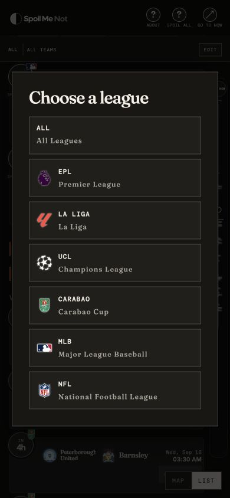
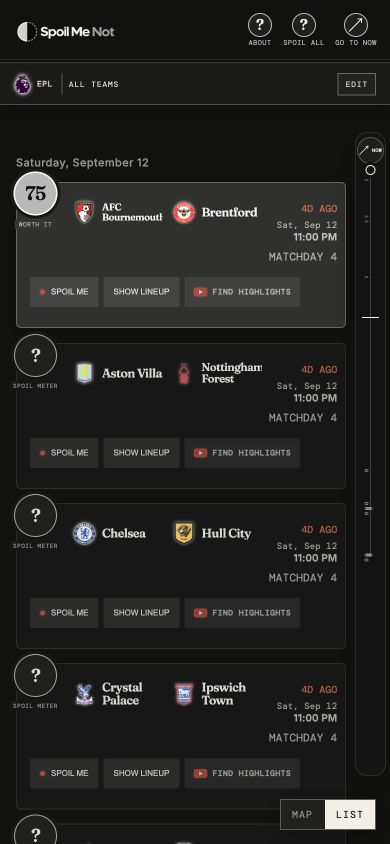
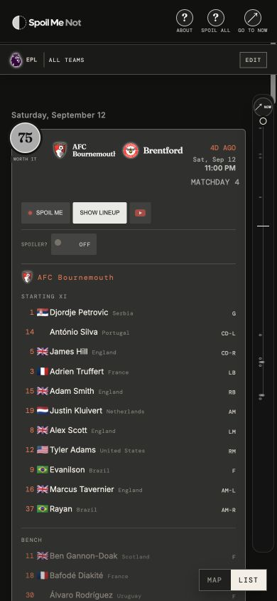
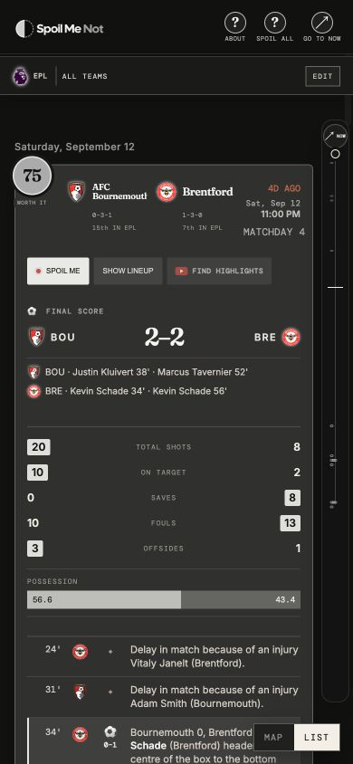

  

# Spoil Me Not

**Decide what is worth watching — without seeing the result first.**

Spoil Me Not is for the sports fan who cannot watch every game live, but still wants the joy of discovering a great one on their own terms. It gathers fixtures across football, baseball, and American football; keeps completed scores and decisive moments out of sight; and offers a spoiler-safe recommendation only when you choose to reveal it.

It is deliberately niche in the best way: for people in another time zone, fans with a full schedule, people who record games, and anyone tired of a sports app giving away the ending before they have even decided whether to press play.

## A quick look

Every example below is captured at a 390px phone width.

### Choose the competitions that matter to you

Start with one competition, or mix them in **All Leagues**. The selector includes the Premier League, La Liga, UEFA Champions League, Carabao Cup, MLB, and NFL. You can then narrow the feed to the teams you actually follow.

### Reveal the Spoil Meter only when you are ready

Completed games begin with a neutral `?`. Revealing it produces a 0–100 recommendation and a small category label, while keeping the score itself hidden until you press **SPOIL ME**.

### Check a lineup without learning the result

Lineups make it possible to see who was available, who started, and who was on the bench before deciding whether to watch. Event annotations can stay hidden behind the compact **SPOILER?** control.

### Spoil yourself only when you mean it

The reveal is intentionally explicit. Football results include the final score, scorers, box score, and a minute-by-minute incident list; MLB and NFL use sport-appropriate scorecards, including innings or scoring drives.

## The Spoil Meter

The Spoil Meter is a **0–100, spoiler-safe recommendation** for completed games. It is not a measure of team quality or a prediction. It answers a simpler question: *if you have time for one replay, how likely is this one to reward you?*

For football, the calculation weighs four bounded signals so that a single stat cannot dominate the result:

| Signal | Weight | What it notices |
| --- | ---: | --- |
| Action | 30% | Balanced pressure: shots on target, saves, total shots, corners, touches in the box, and goals |
| Drama | 30% | Equalizers, lead changes, late or stoppage-time moments, red cards, penalties, and comebacks |
| Competitiveness | 25% | How long the game stayed tied or within one goal, including late pressure |
| Context | 15% | Table proximity, fixture stakes, and an underdog result when standings are available |

A quiet 0–0 with little pressure is deliberately held down. A tense 0–0 with sustained chances and saves can still rate well. MLB and NFL follow the same principle with sport-specific data: inning and lead swings, runs and hits, scoring drives, close finishes, overtime, and exceptional plays.

| Score | Recommendation |
| ---: | --- |
| 80–100 | **MUST WATCH** |
| 65–79 | **WORTH IT** |
| 45–64 | **YOUR CALL** |
| 25–44 | **SAVE YOUR 90** |
| 0–24 | **DON'T BOTHER** |

The visual treatment reinforces the number after reveal: low scores remain quiet and faint; strong scores become brighter, more solid, and more present. Before reveal, every `?` looks the same so the interface does not leak a recommendation.

## Built for spoiler-conscious sports fans

- **One focused feed.** Browse upcoming, live, and past games chronologically, with a scrubber and **GO TO NOW** for quick orientation.
- **Your leagues and teams.** Keep the default all-team view or choose a personal set of clubs and franchises. Those choices carry into All Leagues.
- **Lineups first, spoilers second.** See starters, benches, positions, countries, and flags without accidentally seeing goals, cards, substitutions, or a final score.
- **Sport-aware results.** Football provides match incidents and match stats; baseball shows a compact line score, pitchers, and home runs; NFL follows scoring by quarter and drive.
- **Live without a reload.** Relative time, kickoff countdowns, and live match information refresh in place every minute while preserving the current view and open cards.
- **Highlights when available.** The optional highlight link is selected to avoid score-revealing titles and prefers official competition or broadcaster channels where possible.

## Using Spoil Me Not

1. Choose a league when the site opens, or select **All Leagues**.
2. Use the league and team controls to shape the feed around the games you care about.
3. Look at a lineup, or use the hidden `?` / **SPOIL ALL** controls when you want a recommendation.
4. Press **SPOIL ME** only when you want the final score and match story.

The app uses publicly available sports feeds and video search results, so the depth and timing of details can vary by competition and provider availability. Spoil Me Not is designed to preserve the suspense even when the data is rich.
